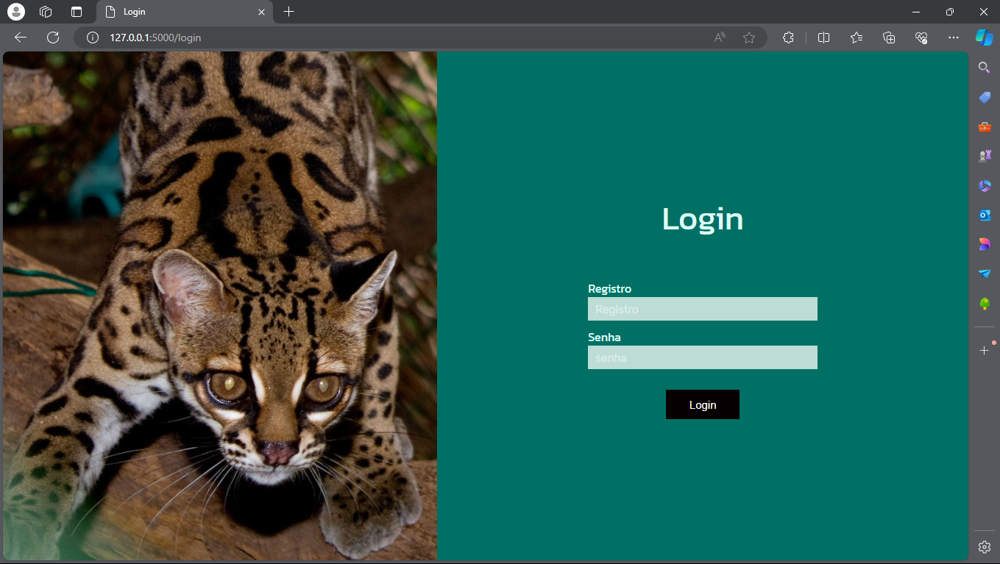
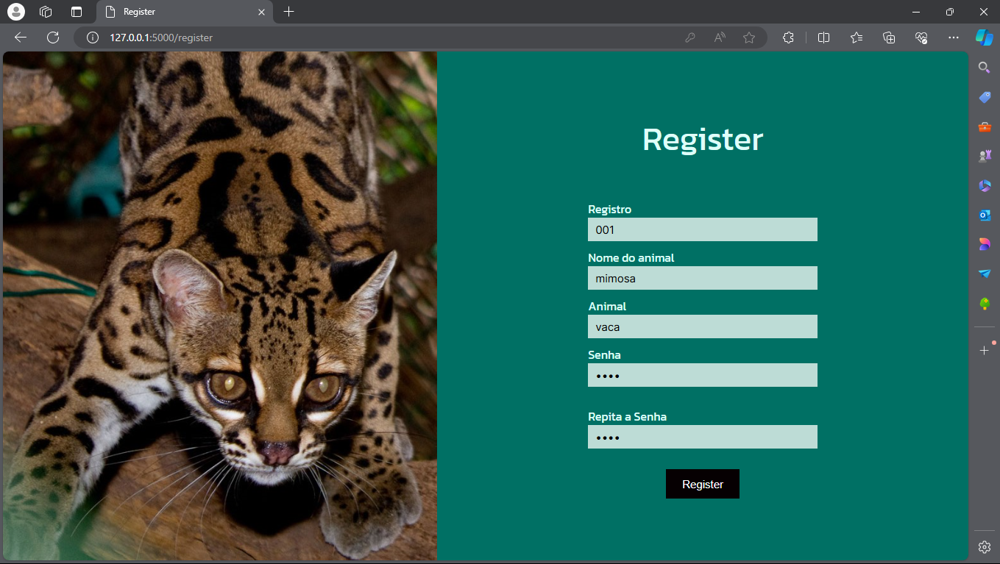
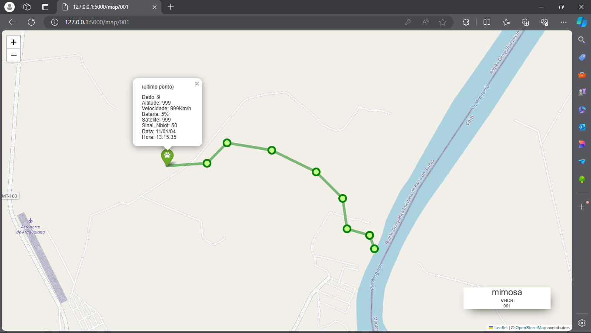

# Software para rastremento de animal silvestre

ola , me chamo isaias, sou estudante de engenharia de controle e automação, recentemente participei de um projeto de pesquisa Segue o Bicho , com o objetivo de criar uma coleira para rastreamento de animais silvestre desenvolvi a coleira utilizando um atmega328p e construir esse Software para receber os dados e plotar em um mapa, e adicionei um login e registro para a coleira

## Stack utilizada

**Front-end:** Html ,Javascript, css

**Back-end:** python com o fremework flask e session

**Protocolos:** MQTT,HTTP

## Screenshots

